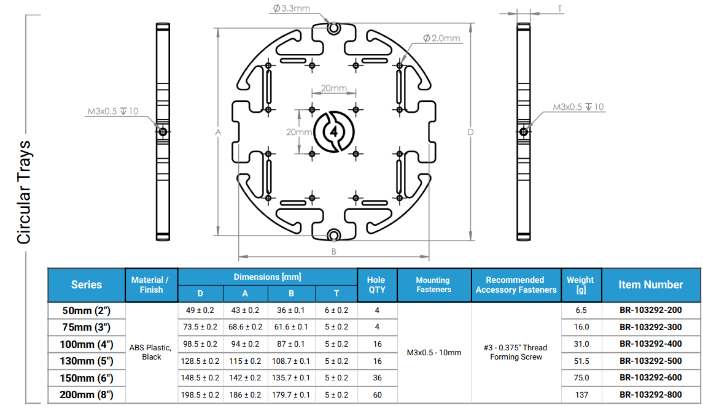
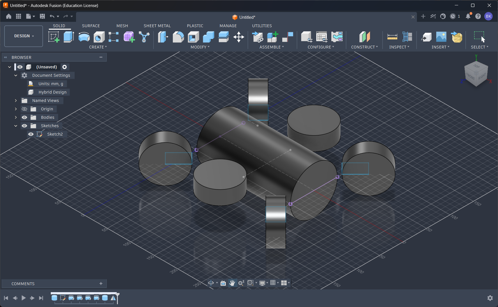
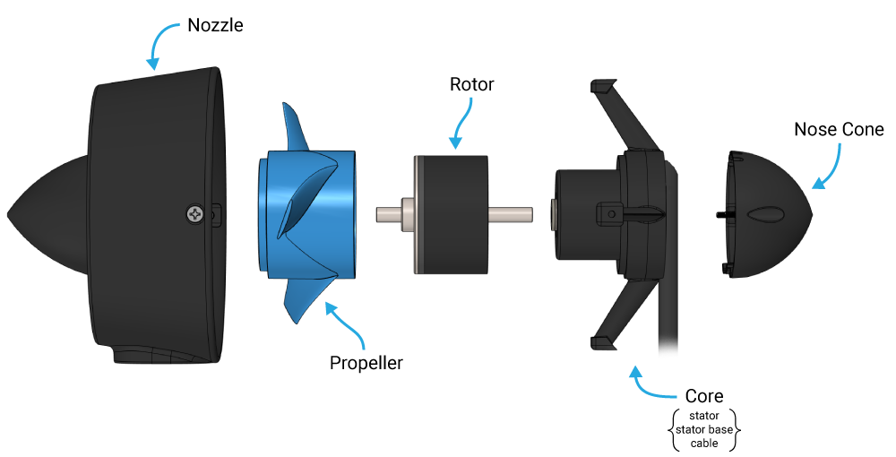
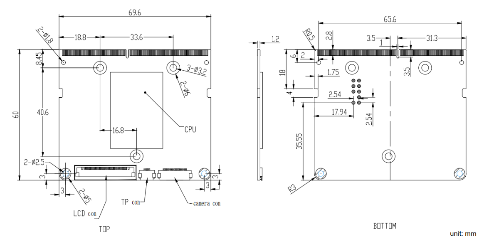
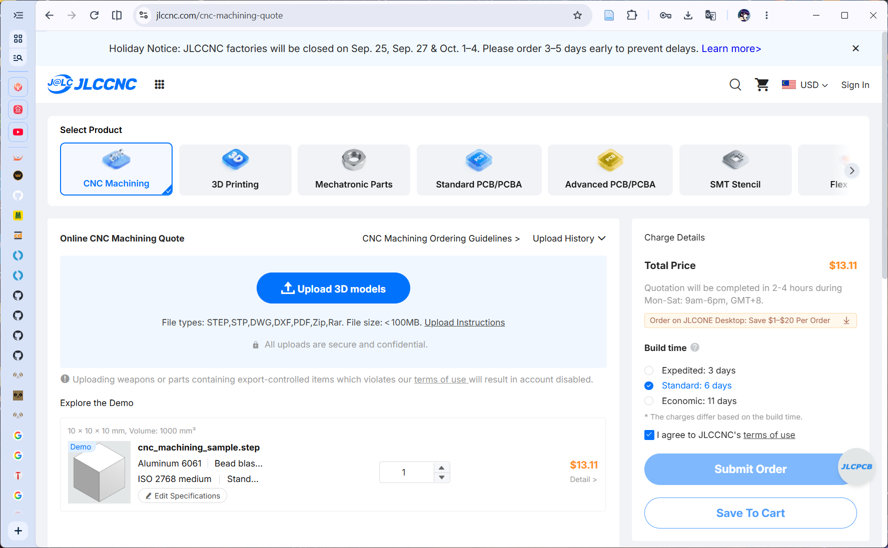
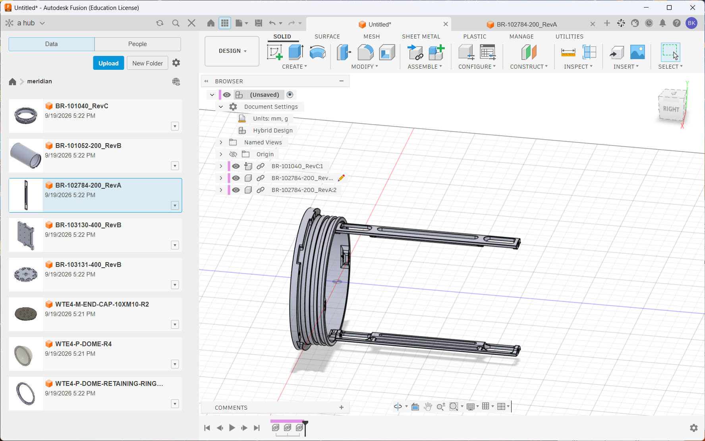
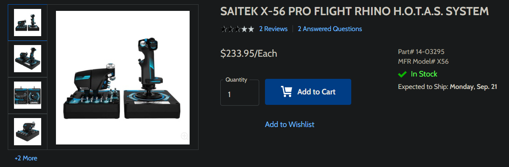
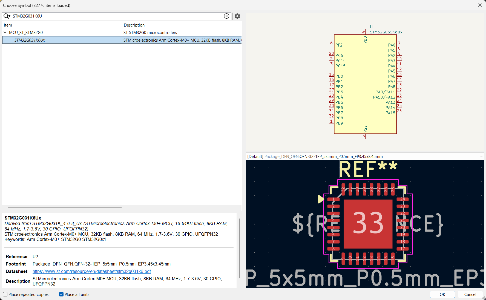

# september 13: one small commit for me, one giant leap for PROJECTKIND!!!

oookie so i made the repo, added the base stuff: a README, the JOURNAL you're lookin at rn, kicad project files, and the BOM

note: pitching in slack as t1, i hope i get accepted!!! (my plan B's to make this a t2 and upgrade after)

this project is going to have mutiple versions adding features successively, more on this later,

version 1 is only going to include the base AUV, SLAM, and water sampling

the base AUV's going to include 4 main PCBs

1. the main board with the SBC and breakouts to other peripherals and boards,
2. a motor controller board for movement and attachments (eg. robotic arms, water sampling),
3. a sensor controller board to process raw sensor input before feeding it into the SBC, and
4. a battery management board to control charging and power distribution

its hull will be made out of an acrylic tube (or tubes), O-rings, hemispheres on the front and back, and include some rails along its side for the modular attachments

the SLAM (aka. simultaneous localization & mapping), will use an array of sonar transceivers and a BLDC motor sweeping across a certain area underneath the AUV to map its surroundings
sonar array

the water sampling will use a peristaltic pump to extract water from its surroundings into a chamber for later analysis

(very) rough BOM: (for v1)
note: the stuff listed here includes the base AUV, water sampling, and recharging
hull and other enclosure bits: about 300

- SBC (lattepanda mu): 190
- mounting rods: 10\*4
- breakout PCBs: 50 (not including components
- gyro: 10
- depth sensor: 80
- propeller w motor: 30
- assorted CNC / 3D printed stuff (eg propellers, attachment parts, internal frames): about 100
- battery packs: 40
- camera: 50
- water sampling stuff - stepper motor: 15, tubes and chamber: 50
- recharging stuff - solar panels: 50
  wires and watertight connectors: 30

**total time spent: 2.2 hours**

# september 13: researching AUV components: enclosure edition

continuing to research the parts and features i'll have here to get a more accurate BOM with all the components i'll need for v1!

i'm planning to waterproof the hull (just the hull, not the arm or anything else, i wanna do that _myself_) with the following [watertight enclosure components from BlueRobotics](https://bluerobotics.com/store/watertight-enclosures/wte-vp/) ([datasheet](https://bluerobotics.com/wp-content/uploads/2026/05/WTE-DATASHEET-RevC.5-MAY2026.pdf)) also all the following BlueRobotics parts are for a 100mm dia. AUV

| part          | quantity | description              | cost / unit (USD) |
| ------------- | -------- | ------------------------ | ----------------- |
| BR-101052-200 | 1        | acrylic tube 200mm len.  | 170               |
| BR-100495     | 1        | clear polycarbonate dome | 42                |
| BR-100665     | 2        | o-ring flange            | 50                |
| BR-102993-002 | 1        | aluminum end cap 10x M10 | 42                |
| BR-100804     | 1        | pressure relief valve    | 32                |
| BR-100574     | 1        | o-ring pick              | 0                 |

total cost: 386

as well as their [RAILS set](https://bluerobotics.com/store/watertight-enclosures/locking-series/watertight-enclosure-rails/) ([datasheet](https://bluerobotics.com/wp-content/uploads/2025/01/WTE-RAILS-DATASHEET-RevA-FEB2025.pdf))

| part          | quantity | description       | cost / unit (USD) |
| ------------- | -------- | ----------------- | ----------------- |
| BR-103290-200 | 2        | narrow rails 200N | 29                |
| BR-103291-400 | 1        | rect. tray        | 24                |
| BR-103292-400 | 3        | circ. tray        | 27                |

~~| BR-103293 | 10 | 3 | mounting screws |~~
~~note: amount of screws is 4x / rect. tray, 2x / circ. tray~~

note: i realized the screws to connect the RAILS parts are included, and the mounting screws mentioned are generic phillips screws

total cost: 163

however...

i'm kinda broke so i might proceed to use the CAD models provided to make custom versions and 3D print them... i should ask BlueRobotics first (personally i don't exactly want to get in legal trouble for violating some kinda copyright law)

sooooo....

i went ahead and asked them if their files were open-source and available to 3D print, and i may or may not also have asked if i could get some parts free (i'm hoping they say yes to both or at least one of them!!!)

note: the 3D models are available under `technical details > 3D models` in their respective product pages

anywho, continuing to look at JLC3DP and JLCCNC quotes for the watertight enclosure parts, the cheapest functional quotes i could get are the following:

| 3D file:        | WTE4-P-DOME-RETAINING-RING-R1.STEP |
| --------------- | ---------------------------------- |
| Dimensions:     | 11.45×11.45×0.65cm                 |
| Volume:         | 13.1 cm3                           |
| Surface Area:   | 103.95 cm2                         |
| 3D Technology:  | SLA(Resin)                         |
| Material:       | 9600 Resin                         |
| Colors:         | White                              |
| Surface Finish: | 01 Sanding, General Sanding        |
| Thread:         | No thread                          |
| Build Time:     | 3 days                             |
| Gross Weight:   | 0.02 kg                            |
| Package Box:    | With JLC3DP Logo                   |
| Qty:            | 1                                  |
| Product Decs:   | Plastic Enclosure -HS Code 392690  |

BR-100495 retaining ring for $1.19

| 3D file:        | BR-101052-200_RevB.STEP           |
| --------------- | --------------------------------- |
| Dimensions:     | 20×11.43×11.43 cm                 |
| Volume:         | 406.6 cm3                         |
| Surface Area:   | 1392.47 cm2                       |
| 3D Technology:  | SLA(Resin)                        |
| Material:       | 9600 Resin                        |
| Colors:         | White                             |
| Surface Finish: | 01 Sanding,General Sanding        |
| Thread:         | No thread                         |
| Build Time:     | 3 days                            |
| Gross Weight:   | 0.74 kg                           |
| Package Box:    | With JLC3DP Logo                  |
| Qty:            | 1                                 |
| Product Decs:   | Plastic Enclosure -HS Code 392690 |

BR-101052-200 for $39.68

| 3D file:        | WTE4-M-END-CAP-10XM10-R2.step     |
| --------------- | --------------------------------- |
| Dimensions:     | 11.43×11.43×1cm                   |
| Volume:         | 78.6 cm3                          |
| Surface Area:   | 257.25 cm2                        |
| 3D Technology:  | SLA(Resin)                        |
| Material:       | 9600 Resin                        |
| Colors:         | White                             |
| Surface Finish: | 01 Sanding, General Sanding       |
| Thread:         | No thread                         |
| Build Time:     | 3 days                            |
| Gross Weight:   | 0.14 kg                           |
| Package Box:    | With JLC3DP Logo                  |
| Qty:            | 1                                 |
| Product Decs:   | Plastic Enclosure -HS Code 392690 |

BR-102993-002 for $7.15

| 3D file:        | BR-101040_RevC.step               |
| --------------- | --------------------------------- |
| Dimensions:     | 11.43x11.43×2.7cm                 |
| Volume:         | 38.71 cm3                         |
| Surface Area:   | 294.7 cm2                         |
| 3D Technology:  | SLA(Resin)                        |
| Material:       | 9600 Resin                        |
| Colors:         | White                             |
| Surface Finish: | 01 Sanding, General Sanding       |
| Thread:         | No thread                         |
| Build Time:     | 3 days                            |
| Gross Weight:   | 0.14 kg                           |
| Package Box:    | With JLC3DP Logo                  |
| Qty:            | 2                                 |
| Product Decs:   | Plastic Enclosure -HS Code 392690 |

BR-100665 without o-rings or locking cord system for $3.52 ($3.52 \* 2 = $7.04)

| 3D file:                 | WTE4-P-DOME-R4.step              |
| ------------------------ | -------------------------------- |
| Dimensions:              | 104.66 x 104.66×49.3mm           |
| Volume:                  | 54875.32 mm3                     |
| Qty:                     | 1                                |
| Material:                | Polycarbonate                    |
| Surface Finish:          | Blue-Tinted Vapor Polishing      |
| Tightest Tolerance:      | ISO 2768 medium                  |
| Appearance Requirements: | Standard                         |
| Threads:                 | No                               |
| Sub-assembly:            | No                               |
| Product Desc:            | plastic End Cap - HS Code 392350 |
| Build Time:              | 6 days                           |
| Gross Weight:            | 0.14kg                           |
| CNC Remark:              | -                                |

BR-100495 clear polycarbonate dome for 89.30

JLC estimates the price of the aforementioned parts at a merchandise total of $144.36 and an estimated shipping fee of $9.78 with UPS Worldwide Express Saver bringing the watertight enclosure's subtotal to $154.14

as for the RAILS parts (excluding screws):

| 3D file:        | BR-102784-200_RevA.step            |
| --------------- | ---------------------------------- |
| Dimensions:     | 14.9×1.5×0.62cm                    |
| Volume:         | 4.99 cm3                           |
| Surface Area:   | 57.59 cm2                          |
| 3D Technology:  | SLA(Resin)                         |
| Material:       | 9600 Resin                         |
| Colors:         | White                              |
| Surface Finish: | 01 Sanding, General Sanding        |
| Thread:         | No thread                          |
| Build Time:     | 3 days                             |
| Gross Weight:   | 0.02 kg                            |
| Package Box:    | With JLC3DP Logo                   |
| Qty:            | 2                                  |
| Product Decs:   | Plastic Connectors -HS Code 392690 |

BR-103290-200 for $0.45 ($0.45 \* 2 = $0.90)

| 3D file:        | BR-103130-400_RevB.step            |
| --------------- | ---------------------------------- |
| Dimensions:     | 8.7×6.8×0.6cm                      |
| Volume:         | 28.55 cm3                          |
| Surface Area:   | 134.47 cm2                         |
| 3D Technology:  | SLA(Resin)                         |
| Material:       | 9600 Resin                         |
| Colors:         | White                              |
| Surface Finish: | 01 Sanding, General Sanding        |
| Thread:         | No thread                          |
| Build Time:     | 3 days                             |
| Gross Weight:   | 0.05 kg                            |
| Package Box:    | With JLC3DP Logo                   |
| Qty:            | 1                                  |
| Product Decs:   | Plastic Base Plate -HS Code 392690 |

BR-103291-400 for $2.6

| 3D file:        | BR-103131-400_RevB.step            |
| --------------- | ---------------------------------- |
| Dimensions:     | 9.85×9.3×0.6cm                     |
| Volume:         | 35.43 cm3                          |
| Surface Area:   | 181.27 cm2                         |
| 3D Technology:  | SLA(Resin)                         |
| Material:       | 9600 Resin                         |
| Colors:         | White                              |
| Surface Finish: | 01 Sanding, General Sanding        |
| Thread:         | No thread                          |
| Build Time:     | 3 days                             |
| Gross Weight:   | 0.19 kg                            |
| Package Box:    | With JLC3DP Logo                   |
| Qty:            | 3                                  |
| Product Decs:   | Plastic Base Plate -HS Code 392690 |

BR-103292-400 for $3.22 (@3.22 \* 3 = $9.66)

JLC estimates the price of the aforementioned parts at a merchandise total of $13.16 and an estimated shipping fee of $6.74 with E-POST bringing the RAILS system subtotal to $19.90

note: on all of the JLCCNC parts listed here, you'll see ISO 2768 medium listed for the tolerances. that means that they follow [this standard](https://jlccnc.com/help/article/iso-2768-tolerance-standards-for-cnc-machining) and for most of the parts, they fall below the over 400 up to 1000 range for nominal lengths which are tighter than most of the equivalent parts cast acrylic variants straight from BlueRobotics at about +-2mm, but their aluminum variants have a roughly equivalent tolerance. however, the only part listed above getting CNCed is the polycarbonate dome, whose original tolerance is +-0.1mm which is tighter than the ISO 2768 medium tolerance so i just wasted a minute of your time lmao

another, more serious note: i asked around on the HC slack about if this would be alright to use, and what i got was more or less the following: i can use them, but it reduces complexity, and a t1 project needs to be pretty complex. so what i'm going to do is go ahead with it (because at the moment i'm just researching and then making the PCBs) while waiting for BlueRobotics' response

added the above BlueRobotics components to the BOM for now

for the circular plates, each one can hold a maximum ~6x6cm PCB, based on its mounting holes on each side, flat against the plate if single sided, but will require standoffs or spacers if double sided

also, i looked around for connectors and i might consider using Samtec AccliMate connectors with an IP68 rating, but more on that later

note: just realized .csv files were included in the gitignore, removed that

**total time spent: 2.05 hours**

# september 14: researching AUV components: thruster edition pt.1

note: i'm planning to change both the hull, external structure, and thrusters in a future version, v1's going to be a pretty minimal version of the whole AUV

they're going to be in a cross-like formation with 2 xtra thrusters in the middle for movement in the z axis, stabilization, and roll, giving the AUV a total of 5 DOF, 3 translation and 2 rotation

**total time spent: 1 hour**

# september 15: researching AUV components: thruster edition pt.2 (abridged)

note: BlueRobotics replied, i'll be contacting their sales dept. to see if i can score a couple of free samples hehe >:3c

i looked at some designs for how to design the [thrusters](https://en.wikipedia.org/wiki/Underwater_thruster) and what i came back with was mostly that sealing anything with that many moving parts gets inefficient and hard way too fast. instead, there are 2 main methods for motors underwater: completely filling any cavities with mineral oil, _preventing_ water from seeping into the motor, or only completely sealing certain electrically active parts like connectors and control boards, leaving the motor itself with its stator and rotor in direct contact with water.

so instead of custom designing a thruster, right now i'm looking for thrusters and motors i can buy to use for the propulsion (and potentially other appendages)

found this: the [APISQUEEN U2 MINI 1.3Kg Underwater Thruster 16V 130W](https://www.underwaterthruster.com/products/apisqueen-u2-mini-1-3kg-underwater-thruster-16v-130w) for $25 each, the only drawback (for this and other thrusters) is that in order to use these, i'll have to strip the connector off for the cable to fit into the [cable penetrators](https://bluerobotics.com/store/cables-connectors/penetrators/wetlink-penetrator-jpt/) on the back of the AUV

there's also this [motor](https://www.underwaterthruster.com/products/waterproof-brushless-motor-100w-2418-corrosion-and-oxidation-resistant-for-use-in-underwater-robots-rovs-unmanned-boats-etc) which i think would be a good choice for the arm, MSIS SLAM or the tether.

i really would like to custom build a thruster like the [T200](https://bluerobotics.com/store/thrusters/t100-t200-thrusters/t200-thruster-r2-rp/), maybe in v2

note: no lapse this time, did this throughout the day in class :<

**total time spent: 1 hour**

# september 16: researching AUV components: subsystem module component edition pt.1 ft. external structure

the external structure is going to be comprised of 4 aluminum rods arranged around and parallel to the hull, for the external sensors and other peripherals to be connected, considering making the brackets connecting the rods to the hull out of something FDM printed for increased structural stability, as opposed to SLA specifically because this doesn't need to be waterproof (also have to look at infill patterns more later)

about the thrusters, in order to offload movement and stabilization tasks i'll have to include 8 independent ESCs on the propulsion control module and maybe a gyro/accelerometer for dead reckoning with it (before you ask, yes i'm too broke to afford a DVL, no i don't think it's crucial for navigation _yet_)

looking at the ST website (aka. glorified ads) for [motor control related stuff](https://www.st.com/content/st_com/en/ecosystems/stm32-motor-control-ecosystem.html), i'm considering integrating one of those into the propulsion control module to reduce overhead and get something maybe like realtime stabilization

due to the limited space constraints i'll be separating the propulsion control module from the peripheral motor control module (also i have to figure out the optimal placement for the components to not overheat)

some the sensors will be located on the sensor control module, however most of the sensors have to be situated on the external rods via a bar clamp mount similar to [this commercially available one](https://www.bulletpointmountingsolutions.com/products/quick-adjust-bar-clamp-mount-with-20mm-connector-end-nubby-edition-fits-0-5-to-2-bars)

as the objective of this whole system is that everything remains completely modular. i'll also need to kinda think about sealing modules outside the hull with o-rings or something, i was thinking of FDM printing rectangular TPU o rings for the exterior modules similar to how the hull's structured, but maybe with a hinged cover instead.

the sensors that could be located inside besides those already mentioned above (which tbh are just the gyro and accelerometer) include a magnetometer (will have to consider its placement relative to the motors and other sources of magnetic interference) a temperature sensor to check if it's overheating, and leakage sensors around the hull's interior and cable penetrators (to make sure i don't end up frying my hardware :p)

on the other hand, the ones that i'm thinking of placing outside (most likely in v2) are a hydrophone, underwater optical / acoustic communication, a DVL, water

note: i'm just going to go ahead and include an MCU on each subsystem to keep the load off of the compute module

the power management module's going to have to manage recharging and communicate with the other modules for a whole lot of power saving optimizations and stuff. for v1, i'm going to include solar cells on the top of the hull for it to recharge when surfacing on low power. one major challenge however is the fact that the batteries used will generate a _considerable_ amount of heat and i'll need to figure out a way to cool it (or i might push that to v2)

note: went afk for a bit to get some tea

now for the thing that will (admittedly) probably be the single most challenging part of this design: the carrier module (note that i am NOT good at making high-speed PCBs, but you know what they say, "make it exist now, make it perfect later")

the compute module carrier's going to be based around the LattePanda Mu and have external storage,

TBC

**total time spent: 1 hour**

# september 17: researching AUV components: subsystem module component edition pt.2

the compute module carrier's going to be based around the LattePanda Mu, have external storage and all the GPIO connectors i'll possibly need to connect it with other stuff

note: i realized that the Mu's dimensions won't fit in the roughly 60\*60mm space provided by the 100mm circular plate, so i have the choice of either using a rectangular plate (sacrificing density) or increasing the diameter (and the price) of the AUV hull

i'll be basing my carrier off of [these resources](https://github.com/LattePandaTeam/LattePanda-Mu) kindly provided by the LattePanda team! i'm going through the docs to get a brief understanding of the pinout and other requirements before designing the carrier board

for the edge connector it uses a standard 260 pin DDR4 SODIMM one with at least >5.2mm clearance to accomodate for retention screws and other passive components, and it's also recommended to use SMD M2 standoffs to secure the compute module to the carrier

for the power supply, it mentions that its min voltage is 9V, its max is 20V with the typical voltage at either 12 or 15V, and that the recommended wattage varies with the 2 processors used (the DFR1146 uses an Intel N100, at >10W with a minimum 50% margin)

the rest of the details i'll figure out in due time while making the carrier board cos right now i'm thinking about how to connect all the boards and their peripherals.

note: if you're wondering why i'm spending so much time researching stuff and not making stuff yet is cos i'm tryna get a complete understand of what i'm workin with here (also listen to this [bossa nova playlist](https://www.youtube.com/watch?v=aZyxGDfXXl8))

note: forgot to push yesterday TwT

**total time spent: 1.1 hours**

# september 18: researching AUV components: enclosure edition pt.2 (the sequel)

so considering the size of the internal components, i'm thinking of increasing the AUV's diameter to the 130mm dia. 300mm len. model, with the rest remaining mostly the same, just with diff. dimensions to fit the new hull (and for some reason it's only available in aluminum i liked the acrylic one more ;A;)

| part          | quantity | description                     | cost / unit (USD) |
| ------------- | -------- | ------------------------------- | ----------------- |
| BR-106280-300 | 1        | aluminum tube 300mm len.        | 210               |
| BR-102597     | 1        | clear polycarbonate dome        | 95                |
| BR-102200     | 2        | o-ring flange                   | 125               |
| BR-102203-002 | 1        | aluminum end cap 5x M14, 5x M10 | 71                |
| BR-100804     | 1        | pressure relief valve           | 32                |
| BR-100574     | 1        | o-ring pick                     | 0                 |

bringing its subtotal to $658 (idt i can afford this...)

at this point, i'm not totally convinced that increasing the size's the best way to go and i am highly convinced that i should be custom manufacturing _at least_ the hull

note: for anyone watching the lapse if i pause for a bit it's cos i'm staring at my ruler trying to picture how everything fits together

if i (slightly) compromise on cooling by putting the compute module and carrier right on top of the batteries (and also barely fitting it on either side of the PCB which is guaranteed to have to be double sided) with the compute module either oriented horizontally (which means that it's going to stick outside the 60mm wide PCB) or vertically

| part          | quantity | description              | cost / unit (USD) |
| ------------- | -------- | ------------------------ | ----------------- |
| BR-100495     | 1        | clear polycarbonate dome | 42                |
| BR-100665     | 2        | o-ring flange            | 50                |
| BR-102993-002 | 1        | aluminum end cap 10x M10 | 42                |
| BR-100804     | 1        | pressure relief valve    | 32                |
| BR-100574     | 1        | o-ring pick              | 0                 |

note: also lapse paused for about 15 mins here

total cost: $216 (slightly better)

TBC

**total time spent: 1 hour**

# september 19: researching AUV components: subsystem module component edition pt.3

went ahead and imported the RAILS and watertight enclosure files into fusion and realized it WOULD NOT be able to hold anything inside without a whole lot of compromises (and i get that the whole AUV design thing is inherently space constrained but still)

so that means i'm going with a 100mm dia. 300mm len. sized AUV, _and_ manufacturing a custom hull to fit the rods and other stuff, maybe a tether for hybrid AUV/ROV use or something

looking at the (estimated) dimensions of [this ESC PCB layout](https://deepbluembedded.com/stm32-esc-pcb-design-foc-esc-bldc-schematic/#more-10615) i'm pretty sure that i'll have to make this a double sided pcb, have multiple sections or both.

about the cable penetrators, i wasn't able to find the diameter of the [previously mentioned thruster](https://www.underwaterthruster.com/products/apisqueen-u2-mini-1-3kg-underwater-thruster-16v-130w), so i'll be switching to a different thruster (preferably one with actual documentation)

currently looking for alternative cable glands and thrusters that work together, and i've been looking at the structure of the T200 (again), where the only sealed bit's apparently the cable and stator, using a motor with an external rotor

note: looking at the [IP ratings](https://en.wikipedia.org/wiki/IP_code) and i can't exactly wrap my head around how a product or anything else really can have a rating of IP58 as the 5 means "Dust protected, Ingress of dust is not entirely prevented, but it must not enter in sufficient quantity to interfere with the safe operation of the equipment." and the 8 "Immersion, 1 meter (3 ft 3 in) or more depth". how on earth can something let dust in but not water. what.

anyways seeing as apparently all the properly documented thrusters cost more than $200 per unit i'll just have to either get something cheap(er) or make my own

time to start looking at the ESC structure, i'll be basing most of the design off of [the OpenESC-20x20](https://github.com/OpenDrone-hw/OpenESC-20x20) (also i'm more than 99% sure the website was ai generated, and i'm concerned for the schematic and PCB quality) and [this STM32 ESC PCB Design](https://deepbluembedded.com/stm32-esc-pcb-design-foc-esc-bldc-schematic/#deepdrive-stm32-esc-pcb-project-video)

most BLDCs are 3-phase, which means they'll need 3 pins per motor, and because i'll have to strip any included connectors off, i'll be using screwless side entry terminal blocks to secure the individual wires on. (not screwed ones for ease of access when in the hull)

the propulsion control module will be split into 2x 4-in-1 ESC units and a flight controller for modularity, horizontal space optimization, and most of all: **making sure i can replace them ~~if~~ when they inevitably explode**

the components of an ESC are more or less the following: (stolen from [this article](https://www.tytorobotics.com/blogs/articles/what-is-an-esc-how-does-an-esc-work))

the MCUs (one MCU per individual ESC) run firmware that controls the gate drivers which are in turn connected to the MOSFETs connected straight to the ESC terminals, track position and velocity via [back EMF modeling](https://developerhelp.microchip.com/xwiki/bin/view/applications/motors/control-algorithms/bldc/position/), and communicate back to the flight controller

TBC

**total time spent: 3.15 hours**

# september 20: researching AUV components: subsystem module component edition pt.4

note: can that thing _really_ be called a flight controller? (if not for convention, it's a swim controller at best)

the protocol (in this case preferably Cyphal, but DSHOT's fine too) is what the flight controller with its firmware (preferably Betaflight) will use to communicate with the ESCs with its firmware (preferably AM32)

now the reason i'm choosing AM32 is for its larger community compared to other ESC firmware (eg. ESCape32) and the fact the BLHeli_S has been **DEAD** for the last what 4 years

might also get a joystick or somethin to control this with eventually

going to start on the ESC first and then move to the FC after, stay tuned!

note: not a lot of writing, am sick rn :< also paused lapse for 20 mins, weird commit time cos i realized i didnt push until the next day

**total time spent: 1 hour**

# september 21: designing the propulsion controller ESC pt.1

note: making this quick, got an exam to study for!

time to get to work designing the ESC!!!

according to the [Betaflight wiki](https://betaflight.com/docs/wiki/getting-started/hardware/esc-firmware#am32) it's compatible with most 32-bit MCUs, so i'll be looking for an MCU that'd be ideal for

it has to have a small enough package size to fit 4 on a board with all the MOSFETS too, maybe a UFQFPN-32 or 48 would do the job

found one (also it's family is more or less stated to be supported), the `STM32G031K6U6`, it's pretty minimal so it seems to be perfect for this job

i'm going to be designing each of the PCBs in a separate KiCad project cos it _still_ doesn't support multiboard designs

note: it happened again, weird commit time cos i realized i didnt push until the next day... hmm i really gotta remember to push

serious note to self: enough stopping half way, taking a break, and forgetting to resume lapse after that, **all entries after this MUST be properly recorded and pushed.**

**total time spent: 1.1 hours**
