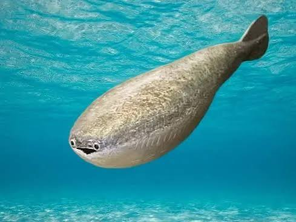

# meridian

note: this project is my attempt at merging my 2 biggest interests and speedrunning them in 2 months and the culmination of about half a year's worth of _severe_ procrastination

second note: no pics yet, will have them once mk. 1 is done!!!

## what is this?

a hybrid autonomous underwater research vehicle for me to use researching coastal waters!

as of meridian mk. 1, it uses 6 thrusters in total for movement: 4 for yaw and forwards / backwards movement, and 2 for roll and upwards / downwards movement. with an acrylic shell with a polycarbonate dome for its inbuilt camera as well as a couple of aluminum mounting rods attached to the exterior, i can attach practically anything i want to it (but they're mostly going to be sensors anyway) and of course, all the stuff inside like the ESCs, FC, sensor board, power management board, carrier board for the compute module are all custom made by yours truly!

> "perpetually a work in progress" - me '26
